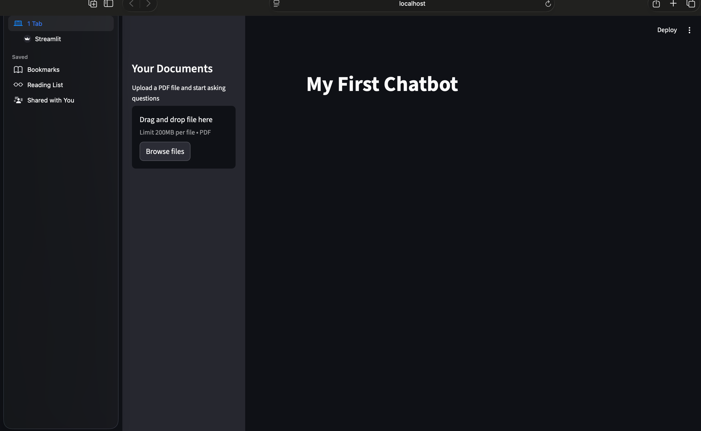
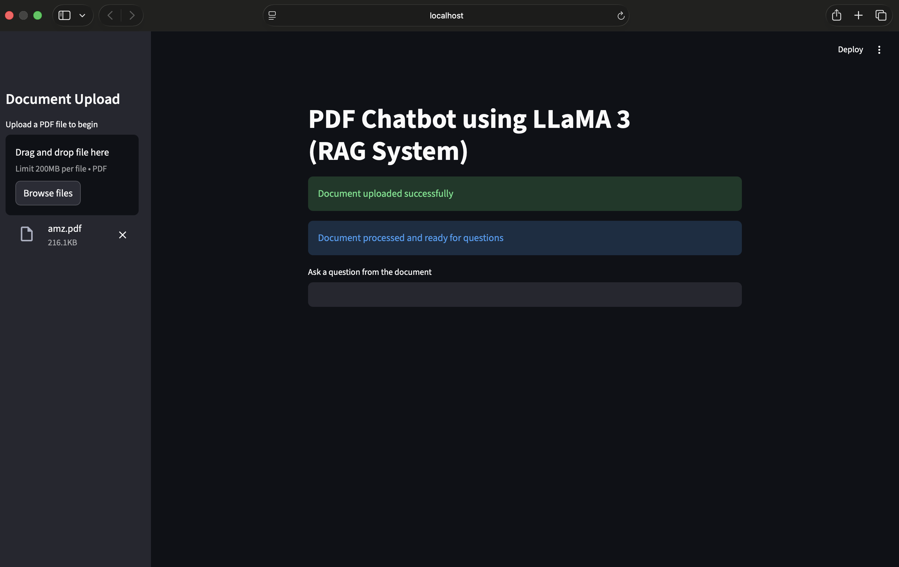
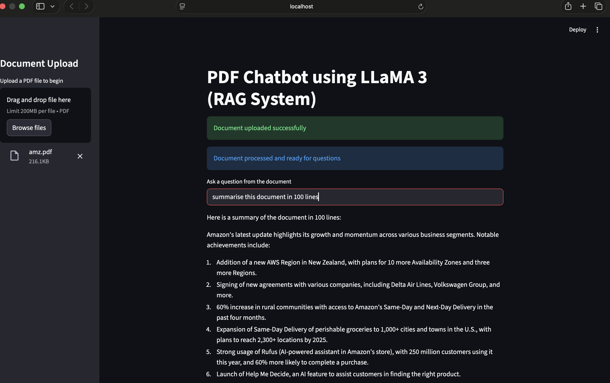

# PDF Chatbot using LLaMA and Streamlit

A Retrieval-Augmented Generation (RAG) based chatbot that allows users to upload PDF documents and ask questions about their contents.

## Features

* Upload PDF documents
* Extract text from PDFs automatically
* Intelligent text chunking using LangChain
* Context-based retrieval system
* Question answering using LLaMA 3 via OpenRouter
* Interactive Streamlit interface

## Screenshots

### Home Screen



### PDF Upload



### Generated Response



## Technologies Used

* Python
* Streamlit
* LangChain
* PDFPlumber
* OpenRouter API
* LLaMA 3

## How It Works

1. User uploads a PDF document.
2. PDF text is extracted using PDFPlumber.
3. Text is split into chunks using RecursiveCharacterTextSplitter.
4. Relevant chunks are retrieved based on the user's question.
5. Context is sent to LLaMA 3 through OpenRouter.
6. The chatbot generates an answer based on the document.

## Installation

```bash
pip install -r requirements.txt
streamlit run yogchatbot.py
```

## Future Improvements

* Vector database integration (FAISS)
* Semantic search with embeddings
* Chat history support
* Multiple PDF uploads
* Source citation support

## Author

Yogalaya Jayakumar

Computer Science Engineering Student
